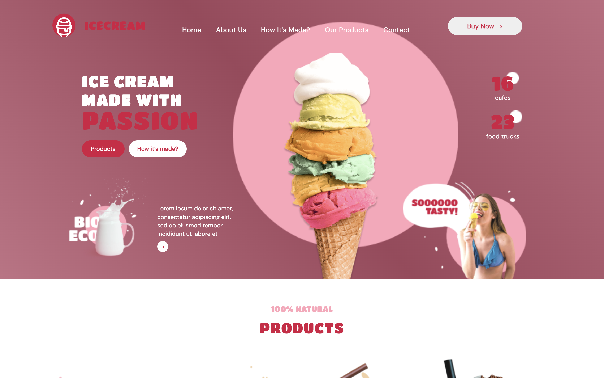
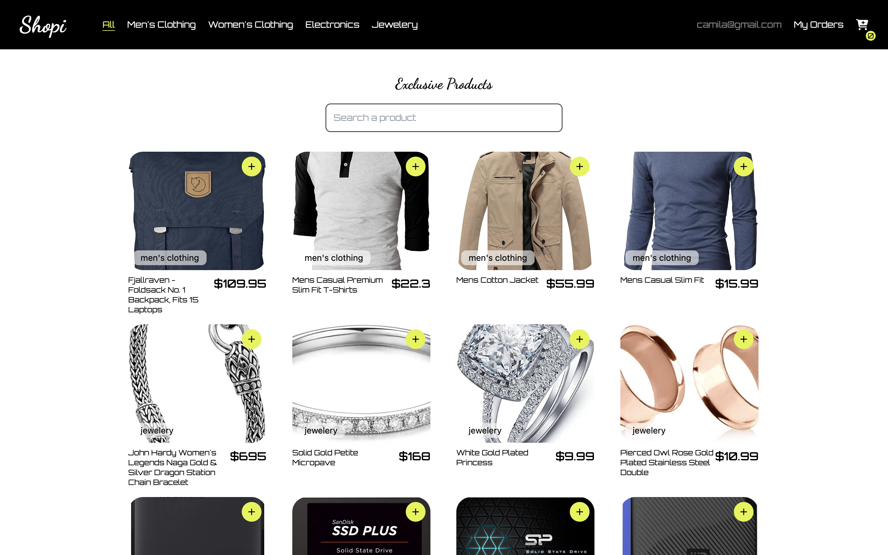

<h1 align="center"> Hola 👋, soy Maria Camila Mendez </h1>
<h2 align="center"> Desarrolladora Frontend </h2>

- 🔬 Tengo 2 años de experiencia desarrollando aplicaciones web, combinando mis habilidades técnicas y analíticas para resolver problemas complejos.

- 💻 Disfruto diseñar y construir interfaces web utilizando tecnologías como HTML, CSS, JavaScript, React y Next.js, con un enfoque en la experiencia de usuario (UX/UI).

- 📫 Cómo contactarme: <a href="mailto:mcmendezmanotas@gmail.com">mcmendezmanotas@gmail.com</a>

- 🔭 Actualmente trabajo en **desarrollo frontend en Inference, desarrollando plataformas web que integran IA generativa.**

## Previsualización de Proyectos
<section align="center">

<table align="center">
  <tr>
    <td style="background-color: #f3f3f3; padding: 20px; border-radius: 10px; margin: 20px;">
      <h3 align="center">IceCream Landing</h3>
      
    </td>
    <td style="background-color: #f3f3f3; padding: 20px; border-radius: 10px; margin-left: 20px;">
      <h3 align="center">Fundación Antivirus</h3>
      
    </td>
  </tr>
  <tr>
    <td style="background-color: #f3f3f3; padding: 20px; border-radius: 10px; margin-top: 20px;">
      <h3 align="center">Shope (Ecommerce)</h3>
      
    </td>
    <td style="background-color: #f3f3f3; padding: 20px; border-radius: 10px; margin: 20px;">
      <h3 align="center">App de Películas</h3>
      
    </td>
  </tr>
</table>

</section>

## Estadísticas de GitHub
<section align="center">
  

</section>

---

## Tecnologías que utilizo

---
